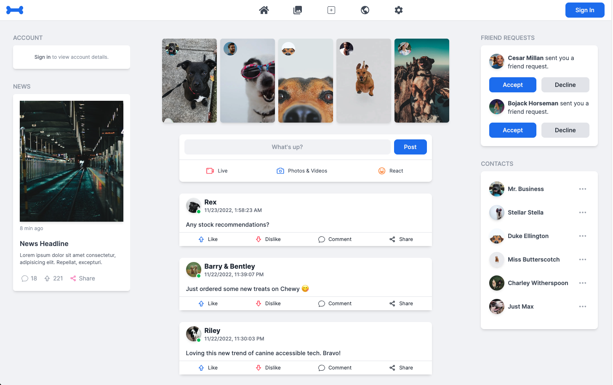
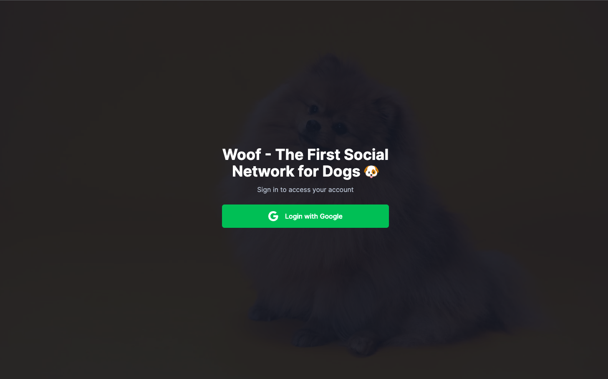
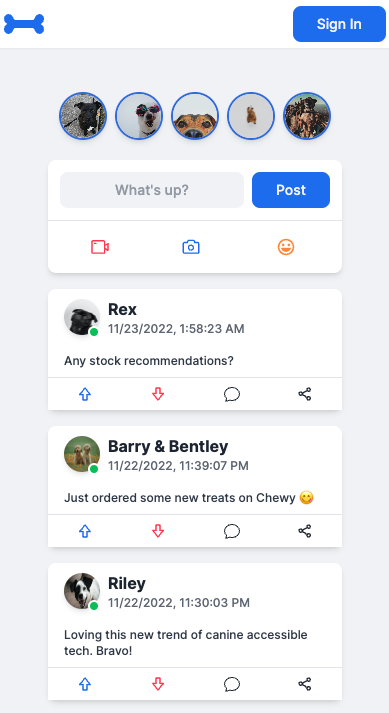

# Woof Social - The Social Network for Dogs 🐶

## <a href="">Live Demo</a>

## Screenshots

### Home



### Sign In



### Mobile



## Overview

Woof Social is a social network for dogs, inspired by Facebook.

**Note: This was just for fun - this app is not actually intended for dogs to use.**

The home page consists of user stories, posts, notifications, news, a friends list and account info.

Users can create an account by signing in via Google and add posts to the timeline.

## Technology


## Install

To clone and run this application, you'll need [Git](https://git-scm.com) and [Node.js](https://nodejs.org/en/download/) (which comes with [npm](http://npmjs.com)) installed on your computer.

From your command line:

```bash
# Clone this repository
$ git clone https://github.com/trdotpy/woof-social

# Go into the repository
$ cd netflix-clone

# Install dependencies
$ npm install

# Create .env file in root directory
$ touch .env

# Set environment variables
GOOGLE_ID = 'Enter Google Client ID'
GOOGLE_SECRET = 'Enter Google Secret'
NEXTAUTH_SECRET = 'Enter Next-Auth Secret'

# Run the app
$ npm run dev
```

## Contact

[](https://github.com/trdotpy/)
[](mailto:tanvi.rahman@outlook.com)
